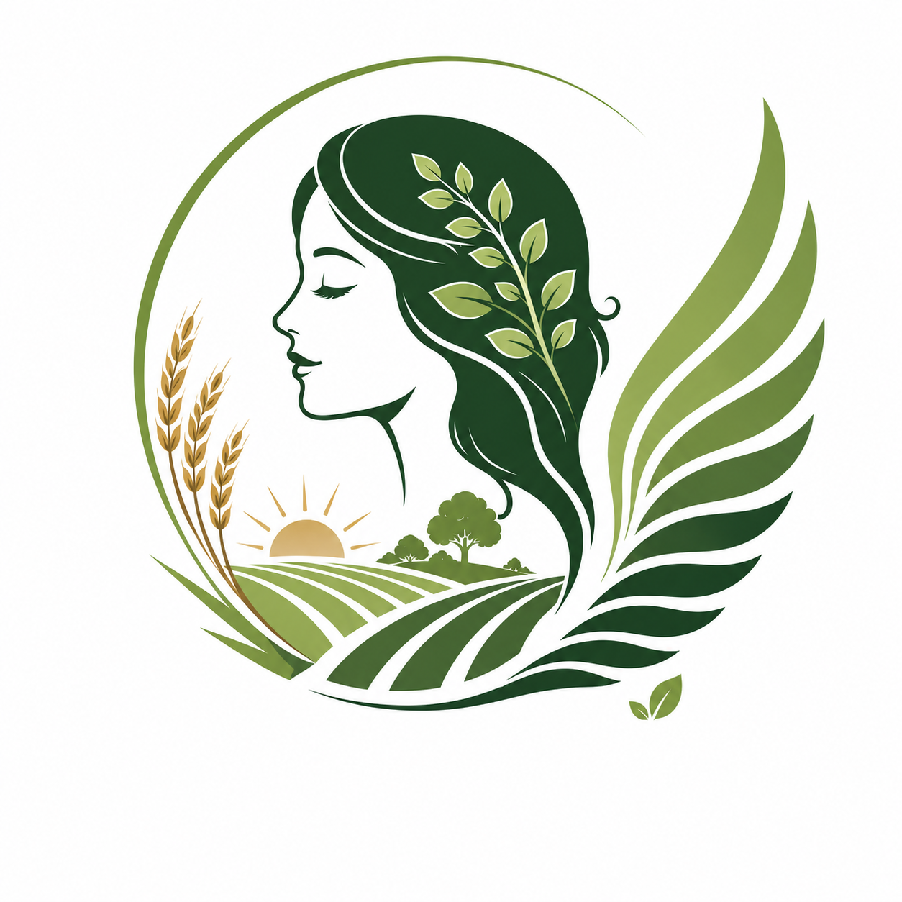

# WINGS-Web

Website for **WINGS-AAS** — *Women's Initiative for Nurturing Growth & Sustainability – Agriculture & Allied Sectors Cooperative Society Limited*, a national women-led agricultural cooperative.

> Empowering Women. Transforming Agriculture. Inspiring Sustainable Futures.



## Status

🏗️ **Built — awaiting content fill.** All 9 pages are implemented per the plan; pages with pending
content (leadership, partners, news) ship with styled placeholders. Remaining items are tracked in
the [content gaps list](docs/05-content-inventory.md#content-gaps-needed-from-wings-aas).

## Development

```bash
npm install
npm run build   # assembles the site into the repo root + compiles Tailwind CSS
npm run dev     # build + serve the site locally
```

- `src/pages/` — one HTML file per page (body content only)
- `src/layout.html` + `src/partials/` — shared document shell, header, footer, CTA band
- `src/css/input.css` — Tailwind entry + component classes
- `src/js/main.js` — reveal animations, counters, header, drawer, form, map (~5 KB)
- `build.mjs` — assembles pages, inlines partials, emits sitemap/robots/`.nojekyll`

### How it's served

The generated site (`index.html`, the other page HTML, `assets/`) is built into
the **repository root** and committed, because GitHub Pages serves this repo
directly from the branch root (**Settings → Pages → Deploy from a branch →
`main` / `(root)`**). A `.nojekyll` file disables Jekyll so the real
`index.html` — not `README.md` — is published as the home page.

> **After editing anything in `src/`, run `npm run build` and commit the
> regenerated root files.** The `Build check` GitHub Action fails if the
> committed output is out of sync with `src/`.

## Documentation

| Doc | Contents |
|---|---|
| [01 — Project Overview](docs/01-project-overview.md) | Goals, audiences, sitemap (8 pages / 9 nav items), content status, key decisions |
| [02 — Design Language](docs/02-design-language.md) | Logo-derived color palette, typography (Fraunces + Inter), shapes, icons, components |
| [03 — Page Layouts](docs/03-page-layouts.md) | Section-by-section layout of every page |
| [04 — Animations](docs/04-animations.md) | Motion principles and the full animation map |
| [05 — Content Inventory](docs/05-content-inventory.md) | Cleaned website copy from the source document + content gaps list |
| [06 — Technical Plan](docs/06-technical-plan.md) | Stack (static HTML + Tailwind + vanilla JS), structure, performance, a11y, SEO, build phases |

## Assets

- `assets/logo/wings-logo.png` — master logo (1254×1254 PNG, extracted from the source content document). Optimized derivatives and favicons are produced during the build phase.

## At a glance

- **Pages:** Home · About (incl. Vision & Mission) · Our Focus · Membership · Get Involved · Leadership & Governance · Partners & Collaborations · News & Events · Contact
- **Design:** organic, warm, institutional — deep forest greens + wheat gold sampled from the logo, cream backgrounds, pill buttons, wing-curve dividers
- **Motion:** elegant & subtle — upward scroll reveals, stat counters, gentle hovers; `prefers-reduced-motion` respected
- **Stack:** static HTML + Tailwind CSS + <6 KB vanilla JS; free static hosting; Razorpay payments planned for phase 5
